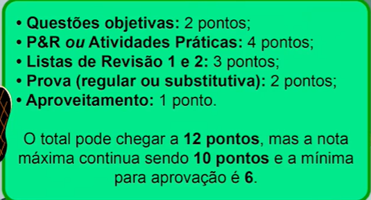

# Onboarding Análise e Desenvolvimento de Sistemas

Plano de estudos DB: Faculdade: Análise e Desenvolvimento de Sistemas (AdS) (<https://www.notion.so/Faculdade-An-lise-e-Desenvolvimento-de-Sistemas-AdS-3539e350bf1a49e0a63da92c8698c4df?pvs=21>)
Categoria: Disciplina Complementar
Status: Concluído
Criado em: January 12, 2024 5:05 PM
Modificado em: January 24, 2024 9:31 AM
Data: 12/01/2024

## Índice

- [Onboarding Análise e Desenvolvimento de Sistemas](#onboarding-análise-e-desenvolvimento-de-sistemas)
  - [Índice](#índice)
  - [Onboarding Análise e Desenvolvimento de Sistemas](#onboarding-análise-e-desenvolvimento-de-sistemas-1)
    - [Como usar as reactions?](#como-usar-as-reactions)
    - [Boas-vindas da Lô](#boas-vindas-da-lô)
    - [Semana Inaugural](#semana-inaugural)
    - [Nosso modelo acadêmico](#nosso-modelo-acadêmico)
    - [Microcertificados](#microcertificados)
  - [Conheça seu ambiente de estudos](#conheça-seu-ambiente-de-estudos)
    - [Disciplinas no seu ambiente de estudos](#disciplinas-no-seu-ambiente-de-estudos)
  - [Como funcionam as avaliações](#como-funcionam-as-avaliações)
    - [Como vão me avaliar](#como-vão-me-avaliar)
    - [Como funcionam as provas](#como-funcionam-as-provas)
  - [Secretaria Acadêmica, como usar?](#secretaria-acadêmica-como-usar)
    - [Conhecendo a secretaria acadêmica](#conhecendo-a-secretaria-acadêmica)
    - [Entrega de documentação](#entrega-de-documentação)
  - [Quem vai te ajudar na sua jornada?](#quem-vai-te-ajudar-na-sua-jornada)
    - [Nosso time de mestres](#nosso-time-de-mestres)
    - [Nosso time de felicidade do aluno](#nosso-time-de-felicidade-do-aluno)
  - [Diferenciais e como acelerar a sua carreira](#diferenciais-e-como-acelerar-a-sua-carreira)
    - [Outros recursos para facilitar seu dia a dia](#outros-recursos-para-facilitar-seu-dia-a-dia)

## Onboarding Análise e Desenvolvimento de Sistemas

### Como usar as reactions?

As reactions servem para medir como estão as aulas.

Sendo elas:

- Raiva → quando sentir que a aula ta tensa, não curtiu algo que aconteceu
- Socorro → algo que te fez sentir confuso
- Tédio → aula sem graça. te fez perder atenção
- Demais → você amou o que o aprendeu, te fez sentir que valeu a pena
- Hahaha → você achou divertido o que foi dito

### Boas-vindas da Lô

Lohane é a moça que está apresentando essa aula, conhecida como Lô.

Esse curso serve para apresentar e dar as boas vindas em relação ao uso da plataforma descomplica.

### Semana Inaugural

A semana inaugural acontece antes da data inicial da graduação justamente para dar boas vindas e apresentar tudo aos alunos.

Por que é importante comparecer?

A semana inaugural é preparada com muitos conteúdos relevantes para toda a jornada, desde apresentação da plataforma até conhecer a pessoa que coordenará o curso.

### Nosso modelo acadêmico

Ao invés de dividir o ano em 2 semestres a descomplica divide o ano em 4 trimestres, isso trás a vantagem de focar em menos disciplinas em menos tempo, fazendo com que o aluno seja mais assertivo na hora do estudo e não fique com matérias acumuladas.

Apesar disso, como se trata de uma faculdade há um calendário de ano letivo que precisa ser respeitado, e quais são as principais datas desse calendário?

- Semana inaugural
- Início das aulas
- Parcial 1 - entrega de exercícios
- Agendamento das provas
- Parcial 2 -
- Período de provas regulas
- Agendamento das provas substitutivas
- Execução das provas substitutivas

### Microcertificados

Microcertificados servem para complementar o currículo de forma que você consiga ao fim de cada trimestre comprovar algum conhecimento adquirido.

## Conheça seu ambiente de estudos

### Disciplinas no seu ambiente de estudos

A plataforma foi desenvolvida pela própria descomplica e pensada para ser simples, intuitiva e direta.

## Como funcionam as avaliações

### Como vão me avaliar

A Descomplica possui formas específicas de avaliar os alunos, sendo elas:

- Avaliações formativas → onde os professores avaliam se os alunos estão indo bem ou não. Servem para melhorar a aprendizagem com exercícios e atividades.
- Avaliações somativas → avaliam se a meta de aprendizado foi alcançada ou não.

A pontuação é distribuída através de diversas formas:

- **Questões objetivas →** são 6 exercícios pra cada aula, somando ao final até 2 pontos.
    - Exemplo: Se tiverem 10 aulas serão 60 exercícios que ao total somam 2 pontos.
- **Pensar & Responder ou Atividades Práticas →** são 4 atividades por disciplina, distribuídas nas aulas 2, 4, 6 e 8 para disciplinas de até 8 aulas (40 horas) ou 2, 6, 10 e 14 para disciplinas de 16 aulas (80 horas). Ao total se somam 4 pontos.
- **Listas de Revisão 1 e 2 →** São 2 listas no trimestres com 5 questões objetivas que podem ser respondidas quantas vezes quisermos até a data de entrega.
- **Prova (regular ou substituitiva) →** elas valem só 2 pontos e são aplicadas no final do trimestre
- **Aproveitamento →** o aluno precisa consumir pelo menos 75% de cada disciplina do trimestre do conteúdo para receber 1 ponto. Esse ponto também vale para o recebimento do microcertificado.

Se forem alcançados os 6 pontos com as questões e atividades as provas se tornam facultativas.

### Como funcionam as provas

As provas são online, mas não necessariamente de forma remota.

Cada disciplina possui 8 questões por prova.

Cada prova possui o tempo de duração de 3h30m

Segundo exigência do MEC todos os alunos precisam realizar pelo menos 1 prova presencial dentro de cada semestre.

> **Por conta disso, sempre no 2º trimestre de cada semestre será feita uma prova presencial no polo da descomplica**
>

A prova substitutiva funciona da mesma forma que as regulares, mas servem para substituir uma nota no caso de não ter sido feita a prova regular. Diferente das provas regulares, toda prova substitutiva será feita de forma online e remota.

## Secretaria Acadêmica, como usar?

### Conhecendo a secretaria acadêmica

Na Secretaria Acadêmica encontramos todas as informações da matrícula e também alguns links úteis para solicitações que podem ser feitas ao longo do curso.

Pra início de conversa, o que significa RA? RA significa Registro Acadêmico, ou seja, o número da matrícula.

Cada um tem um RA para cada curso que fizer na descomplica.

### Entrega de documentação

## Quem vai te ajudar na sua jornada?

### Nosso time de mestres

- Abaixo uma lista de atividades exercidas pelos **professores** da descomplica:

    

- Já os **tutores** são os responsáveis pela disciplina:

    

- Enquanto isso, os **coordenadores**:

    

### Nosso time de felicidade do aluno

O time de felicidade do aluno é responsável por cuidar da satisfação do aluno.

É ele quem interage com os alunos via redes sociais, emails, etc…

No dia a dia:

- Eles estão sempre prontos a atender e manter os alunos informados sobre os principais marcos da jornada.
- Emails, telegram, whatsapp, instagram, etc
- Para contatar podemos abrir um chat direto na plataforma de aulas, ele fica no canto inferior esquerdo da tela.
- Como alternativa podemos enviar um email para <socorro@descomplica.com.br>

## Diferenciais e como acelerar a sua carreira

### Outros recursos para facilitar seu dia a dia

Para acessar, entrar na tela de alunos:

- A biblioteca:
    - Usar email e senha de acesso à plataforma
- A central de carreira:
    - Nessa parte conseguimos participar de estágios e oportunidades
    - Entrar em contato com a central de felicidade do aluno
- tem o aplicativo da Descomplica que as aulas podem ser baixadas
- Atendimento psicopedagógico serve como um bate papo privado para relatar dificuldades emocionais que podem estar impedindo o estudo
    - Para acessar isso, o bate papo e selecionar a opção de “Divã psicopedagógico”
- Também existem os grupos de turma do Telegram para cada curso, isso mantém a gente perto dos colegas.
